# Procesverslag
Markdown is een simpele manier om HTML te schrijven.  
Markdown cheat cheet: [Hulp bij het schrijven van Markdown](https://github.com/adam-p/markdown-here/wiki/Markdown-Cheatsheet).

Nb. De standaardstructuur en de spartaanse opmaak van de README.md zijn helemaal prima. Het gaat om de inhoud van je procesverslag. Besteedt de tijd voor pracht en praal aan je website.

Nb. Door *open* toe te voegen aan een *details* element kun je deze standaard open zetten. Fijn om dat steeds voor de relevante stuk(ken) te doen.

## Jij

### Ontwerper:
Alex Lanting

#### Je startniveau:
Mijn startniveau is: Rood

# Je plan

  
De eerste versie/schets van je ontwerp & je persoonlijke uitdaging

  ### De eerste versie/schets:
  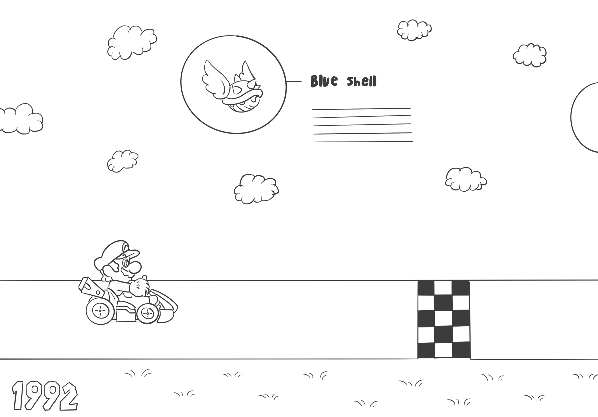

  ### Je ambitie: 
  Aan deze technieken/punten wil ik werken:
  - Animaties met css 
  - Position met css 
  - Interactie met css & js 
 

## Voortgang/Feedback 1

  
Mijn bevindingen + wijzigingen (minimaal 5)

  ### Bevinding 1:
  Ik heb nu de basis van mijn concept uitgewerkt in codepen. Ik moet de styling en andere interactieve elementen nog toevoegen.
   
  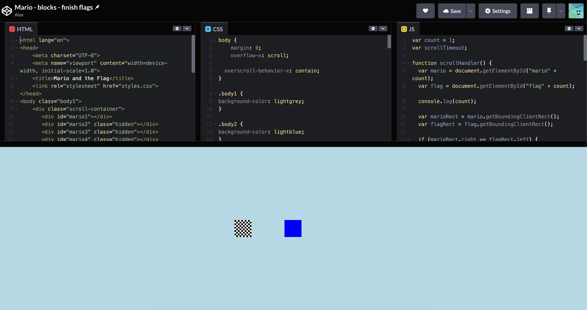

  #### oplossing:
  Ik ga de code nu van codepen naar lokaal verplaatsen zodat ik aan de styling en andere elementen kan werken. 

  ### Bevinding 2:
  Wanneer Mario over een flag heen gaat moet ook de achtergrond veranderen

  #### oplossing:
  Ik heb de body een class gegeven die steeds optelt van body1 naar body2 enzovoorts, hierdoor kan ik de background image per body veranderen. 
   
  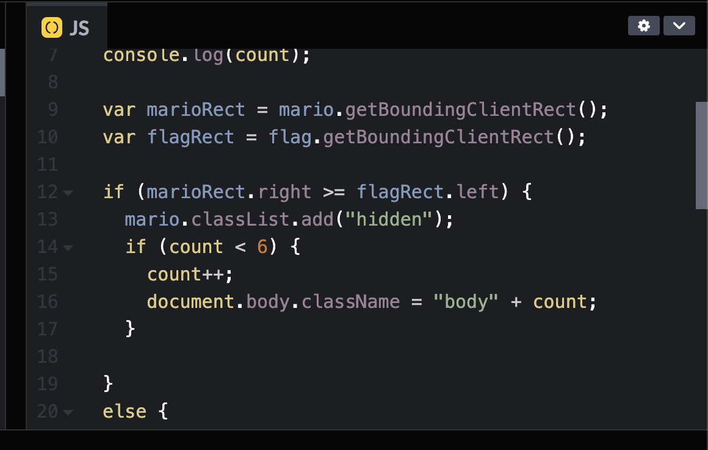

  ### Bevinding 3:
  Wat ga ik maken als mario aan het einde van de website is? 

  #### oplossing:
  Ik heb een finish animatie gemaakt net zoals je in het spel te zien krijgt wanneer je de game finished. 

  ### Feedback:
   
  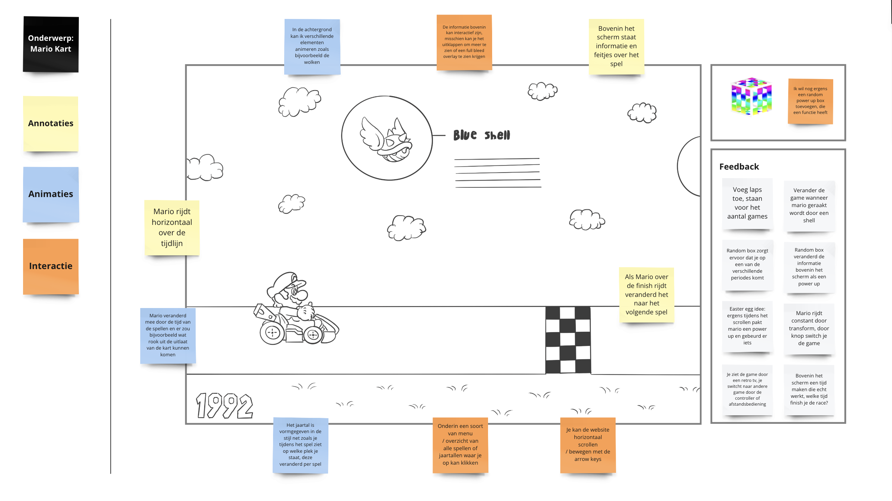

## Voortgang/Feedback 2

  
Mijn bevindingen + wijzigingen (minimaal 5)

  
  ### Bevinding 1:
  De html code heeft veel classes en ID's die niet noodzakelijk zijn
 
  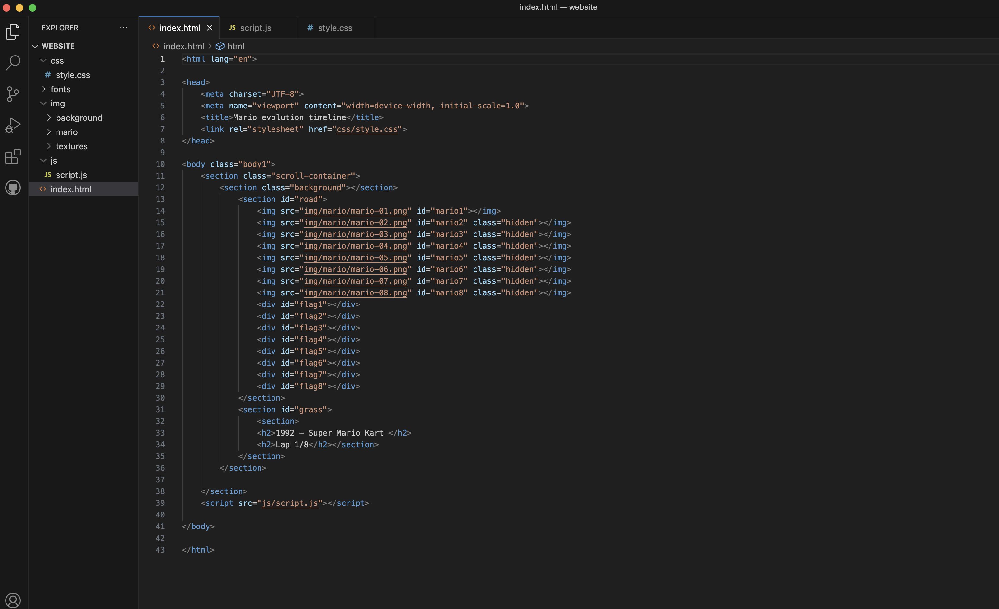

  #### oplossing:
  Ik heb alle classes en ID's die niet nodig zijn weg gehaald en in de css anders aangesproken. Ook heb ik wat onnodige wrapper elementen weggehaald, en   divs vervangen voor sections. 
 
  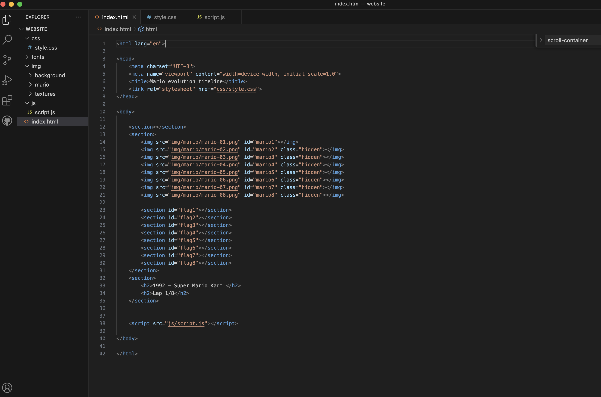

  ### Bevinding 2:
  Ik moet nog progressive disclosure toevoegen in mijn ontwerp. 

  #### oplossing:
  Ik heb een information button toegevoegd die in beeld komt aan het einde van de random box, als je hier op klikt zie je meer over de huidige Mario Kart game.

  ### Bevinding 3:
  Aan de onderkant van de website staat nu een groene kleur, maar het zou beter zijn als beneden de weg ook het gras van de huidige game laat zien. 

  #### oplossing:
  Ik heb een gras texture gemaakt voor elk spel en laad deze nu als background image in zodat er onder de weg ook gras is. 
  

  ### Feedback:
   
  
   
  

## Voortgang/Feedback 3

  
Mijn bevindingen + wijzigingen (minimaal 5)

  
  ### Bevinding 1:
  Ik had nog niet meerdere input manieren op de website. 

  #### oplossing:
  Ik heb scrollbuttons toegevoegd, zodat je ook met je muis kan scrollen door te klikken. 
   
  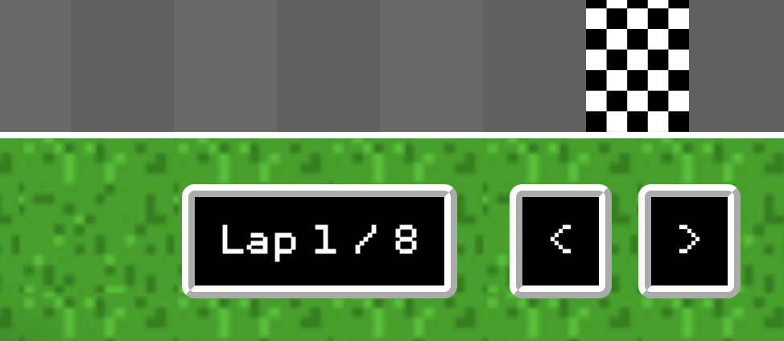

  ### Bevinding 2:
  Ik had nog geen start scherm met een beetje uitleg over wat voor een website het is. 

  #### oplossing:
  Ik heb een startscherm gemaakt met allemaal items uit Mario Kart die rondvliegen en een uitleg. 
   
  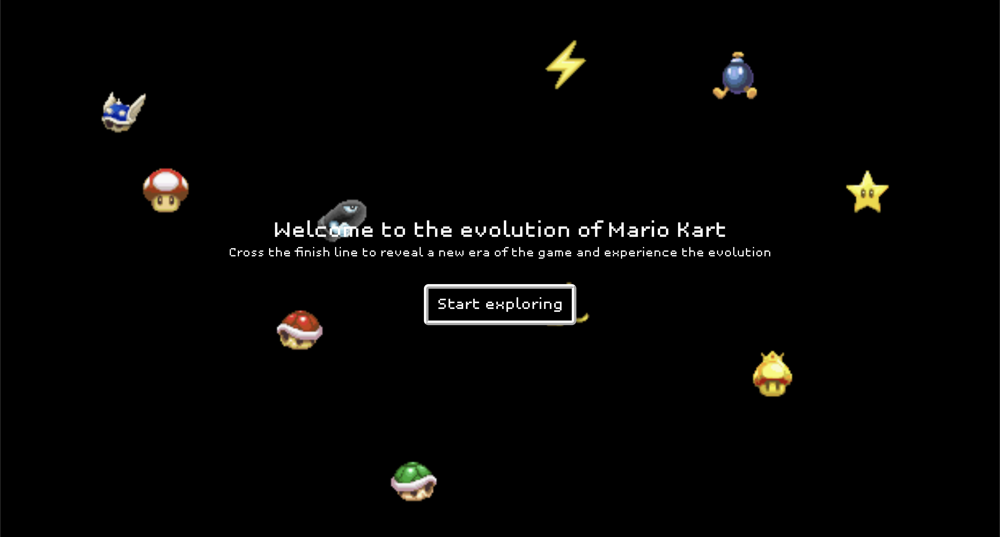

  ### Bevinding 3:
  de buttons op de website hebben nog een focus state. 

  #### oplossing:
  Ik heb een focus state toegevoegd wanneer de button focus heeft. 

  
  ### Feedback:
   
  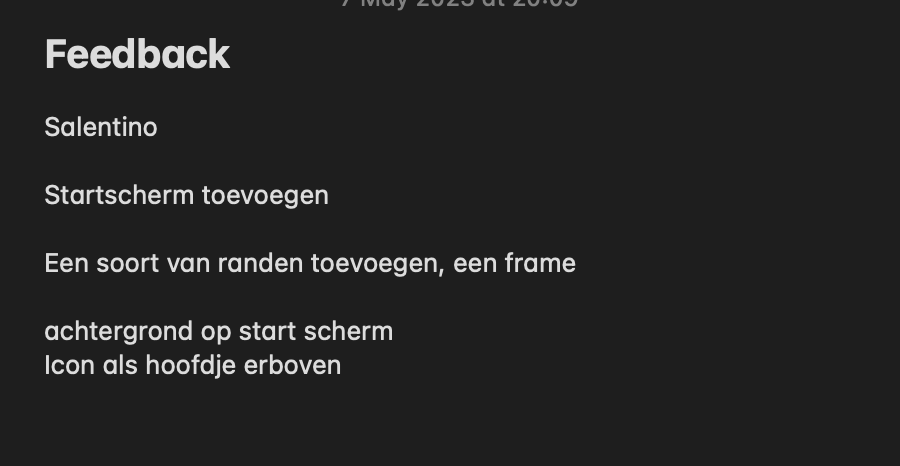

## Reflectie

  
Mijn eindresultaat & persoonlijke ontwikkeling

  ### Je uitkomst - karakteristiek screenshot(s):
  
  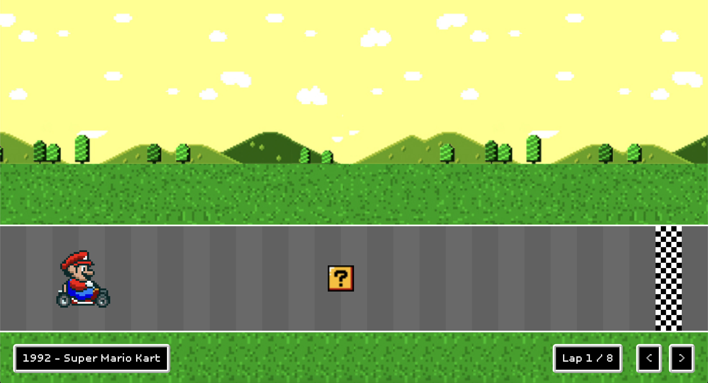
  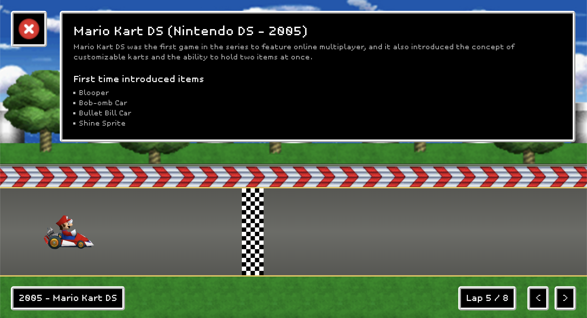
  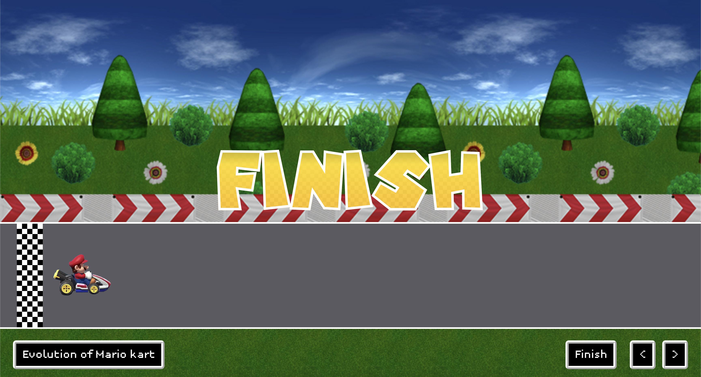

  ### Dit ging goed/Heb ik geleerd: 
  Ik heb mijzelf verder gespecialiseerd in HTML & CSS, ik begrijp beter hoe de verschillende position elementen elkaar beinvloeden. Verder heb ik in css bijvoorbeeld een "ridge" border gebruikt, ik had geen idee dat dit bestond. Javascript begrijp ik een stuk beter. Bovendien heb ik het project op een creatieve manier aangepakt, ik heb code geschreven die ik zelf ook leuk vond om te schrijven.  

  ### Dit was lastig/Is niet gelukt:
  Het was lastig om alle verschillende assets te verzamelen van Mario Kart. Verder wou ik bijvoorbeeld nog een race mode toevoegen maar hier had ik niet genoeg tijd voor. Javascript blijf ik toch de lastigste code vinden en hierbij duurde het soms even voordat alles werkte. 

## Bronnenlijst

continu bijhouden terwijl je werkt

Nb. Wees specifiek ('css-tricks' als bron is bijv. niet specifiek genoeg).

1. Finish font mario (https://www.underware.nl/fonts/unibody/download/)
2. Unibody 8 font (https://fonts.adobe.com/fonts/unibody-8)
3. Mario Kart items en sprites (https://www.spriters-resource.com/)

